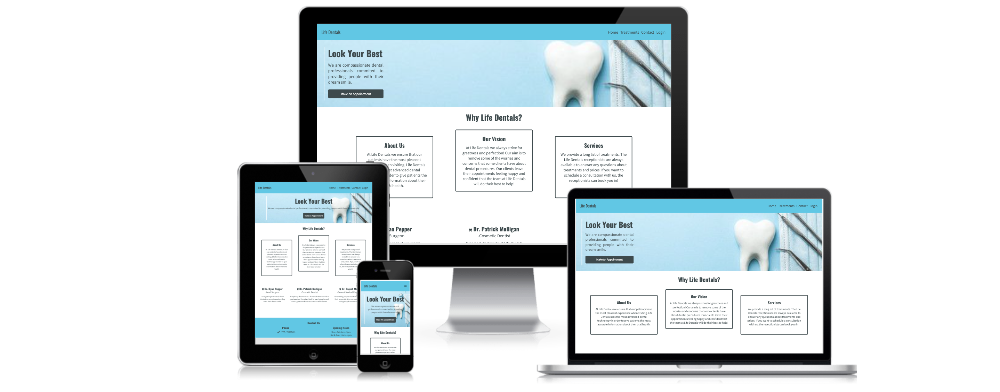

# Life Dentals

## Introduction

Life Dentals is a full stack web application built for the purpose of allowing users to book in for a dental service with the fictional organisation. Life Dentals is my fourth portfolio project with Code Institute.

The link to the live version of this project can be found [here](https://life-dentals.herokuapp.com/).

## Table of Contents

* [User Experience](#Introduction)
    * [Site Goals](#Site-Goals)
    * [User Stories](#User-Stories)
    * [Strategy Plane](#Strategy)
    * [Scope Plane](#Scope)
    * [Structure Plane](#Structure)
    * [Surface Plane](#Surface)
        * [Design](#Design)
    * [Features](#Features)
    * [Testing](#Testing)
    * [Bugs](#Bugs)
    * [Deployment](#Deployment)
    * [Credits](#Credits)
    

## UX

### User Stories

* As a user, I want to a clear form of navigation so that I can navigate through the site more easily.

* As a user, I want to be able to book an appointment so that I can have the required treatment.

* As a user, I want to update or cancel my bookings so that I can reschedule for a later date.

* As a user, I want to be able to register and log in so that I can view my bookings.

* As a user, I want to view all available treatments so that I can choose the appropriate booking.

* As a user, I want to read any testimonials so that I can read people's opinions and experiences of the provided service.

* As a user, I want to have access to contact information, so that I can get in touch with the clinic.

* As an admin user, I want access to all patient bookings so that I can delete or update any bookings (incomplete).

### Site Goals

* As a site owner, I want to provide a service to people looking to receive oral care so that they can improve their oral health.

* As a site owner, I want to provide users with a visually appealing website so that they have a positive user experience when browsing the site.

### Strategy

* Life Dentals is a dental service web application that provides both regular users, and users that have created an account, with information about the services that are available at Life Dentals. Users that have created an account gain access to the booking feature, allowing them to book in with Life Dentals for anytime, for any treatment, for any date.

* The overall design is quite simple, reducing the barrier that users sometime face when visiting their favourite sites.

### Scope

Features to be included:

* Responsive Design - The site should function correctly on all screen sizes. The design should allow users to have a good experience when visitng the site no matter what device they use when visiting.

* Navigation -  Navigation elements should be clear to the user. The main site navigation should be clear to the user that the links will bring them to other pages on the site.

* Users should be able to create, update and delete a booking if they have created an account. This feature should not be available to users who do not have an account.

### Structure

### Surface

*  #### Design

  * Colours
    - 
    - 

  * Icons:
    - Font Awesome was used to add icons to multiple sections throughout the site, such as the employee section on the homepage and the footer.

  * Typography:
    - Google Fonts was used to add the "Assistant" font to the project. The "Assistant" font family was chosen as I felt it added to the simple yet visual aesthetic.

#### Wireframes
* Balsamiq was used for this project. Balsamiq allowed me to create mockup designs for each feature and layout for this project.

#### Database Schema

* The Life Dentals project makes use of 3 custom models - Booking, Treatment and User. The screenshot displays an extra custom model - Testimonials - which I was unable to implement due to time restraints. A user profile is required in order to create a booking. The treatments model is then also linked to the booking model so that when users create a booking, they can choose from all available bookings that are stored within the databse.

### Features

#### Homepage

- The homepage is the first page the user is directed to when visiting Life Dentals. The homepage provides users with basic details about Life Dentals, such as - details about the members of staff, the Life Dentals vision and a link for the user to create their first booking.

**Site Owner Goal related to this feature:**

* As a site owner, I want to provide users with a visually appealing website so that they have a positive user experience when browsing the site.

#### Navigation

- The navbar is fully responsive and correctly links to the appropriate pages provided within the navigation. The responsiveness of the navbar provides users to be able to naviagte throughout the site no matter what device they use.

**User stories related to this feature:**

* As a user, I want to a clear form of navigation so that I can navigate through the site more easily.

#### Treatments Page

- The treatments page provides users with information about the available treatments at Life Dentals. Information includes: treatment name, priceand procedure duration. Patient testimonials are also present at the bottom of the page so that users can read about some of the patient experiences.

**User stories related to this feature:**

* As a user, I want to view all available treatments so that I can choose the appropriate booking.

* As a user, I want to read any testimonials so that I can read people's opinions and experiences of the provided service.

#### Contact Page

- The contact page allows users to get in contact with the Life Dentals staff by sending them a message through the contact form. Once a user has filled in the required fields, they can send their query which will be received by the Life Dental email.

**User stories related to this feature:**

* As a user, I want to have access to contact information, so that I can get in touch with the clinic.

#### Register & Login

- Depending on if a user has created an account or not - they will be shown different links within the sites main navigation. If a user is signed in, the "booking" navigation link will appear, and the "login" navigation link changes to "logout".

- The register page provides the user with a form to register for an account. The form requires to fill in multiple fields - which upon a successful completion - will grant the user access to create a booking.

**User stories related to this feature:**

* As a user, I want to be able to register and log in so that I can view my bookings.

#### Booking

- The create booking page provides the user with a form to create their own booking by selecting a time, date and treatment. Each time the user selects a different date the available time slots for the date they have chosen will be displayed to them.

- The edit booking page allows the user to update/edit their booking. This allows the user to change the date, time or treatment of their pre-existing booking.

- The delete booking page gives the user the ability to delete their booking. When the user clicks the "delete button", they are prompted with a message that asks if they would like to continue with the deletion.

### Future features

### Technologies

### Testing

#### Manual Testing
Test Cases:

### Bugs

#### Fixed Bugs

### Deployment

### Credits
